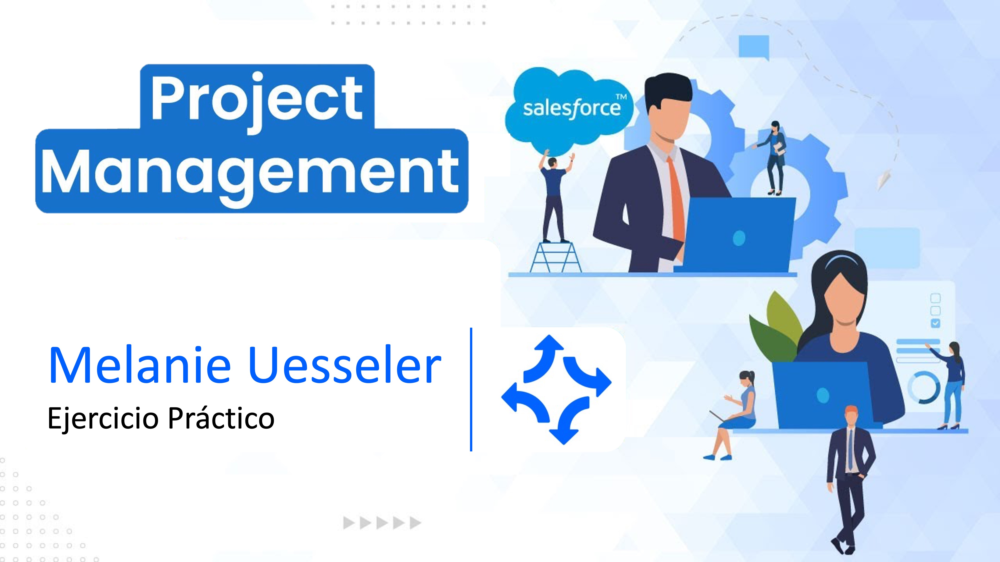

<h1 align="center">
  <br>
Solución de ejercicios
  <br>
</h1>


## Tabla de contenido

- [Ejercicio 1 - Instalación del ambiente](#ejercicio-1---instalación-del-ambiente).
- [Ejercicio 2 - Protocolo HTTP](#ejercicio-2---protocolo-http).
- [Ejercicio 3 - Ejercicio Práctico Postman](#ejercicio-3---ejercicio-práctico-postman).
- [Ejercicio 4 - Trailhead](#ejercicio-4---trailhead).
- [Ejercicio 5 - Objetos de Salesforce](#ejercicio-5---objetos-de-salesforce).
- [Ejercicio 6 - Conocimientos Básicos](#ejercicio-6---conocimientos-básicos).
- [Ejercicio 7 - Conocimientos Básicos](#ejercicio-7---dataloader).

## Ejercicio 1 - Instalación del ambiente
[(Back to top)](#tabla-de-contenido)

Se realiza la instalación del ambiente para el desarrollo práctico. 
Aplicaciones instaladas:
1. IDE Visual Studio Code

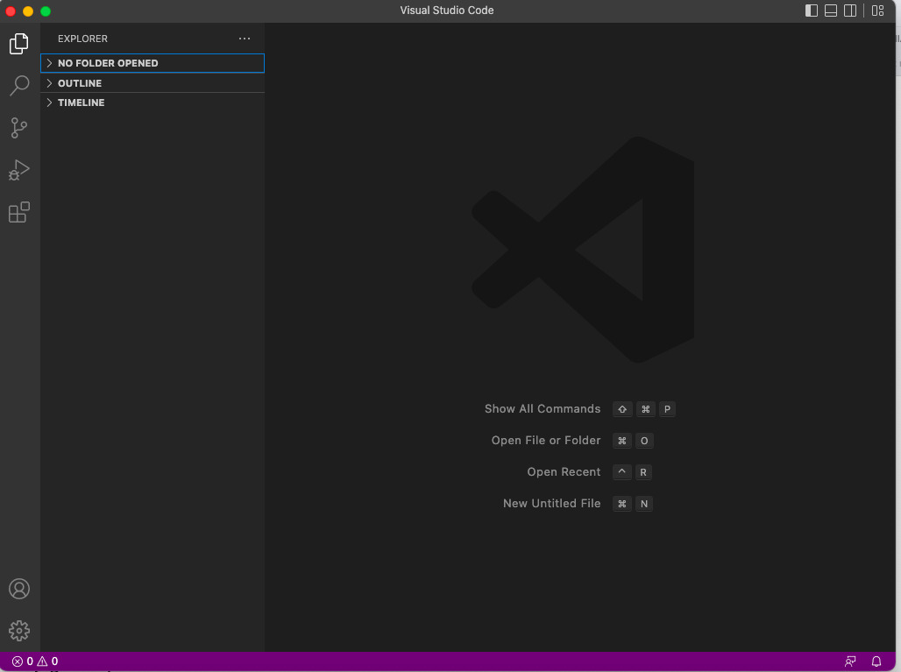

2. GIT y GIT Bash

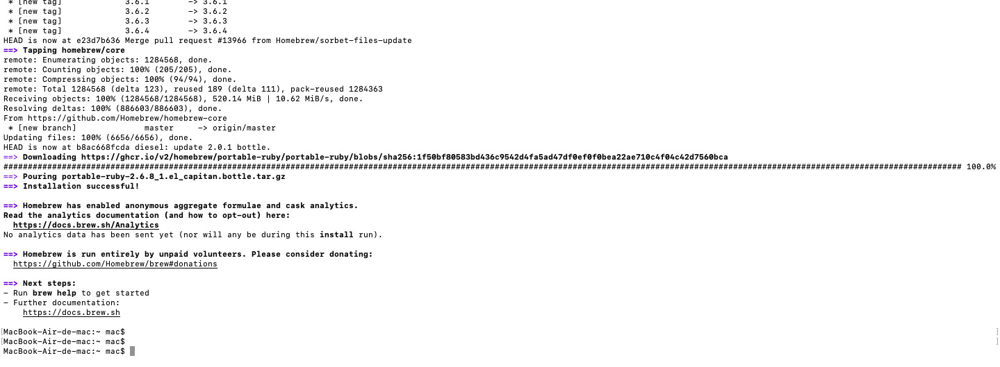


## Ejercicio 2 - Protocolo HTTP
[(Back to top)](#tabla-de-contenido)

1.¿Qué es un servidor HTTP?

<details><summary><b>Respuesta</b></summary>

    Es un protocolo basado en el principio de cliente-servidor que permite la comunicación entre capas, 
    permitiendo almacenar los archivos que forman los sitios web y mostrarlos a los usuarios cuando 
    estos lo solicitan.

</details>

2.¿Qué son los verbos HTTP? Mencionar los más conocidos 

<details><summary><b>Respuesta</b></summary>

Métodos de petición para indicar la acción que se desea realizar para un recurso determinado. 


| Verbo HTTP | Acción |
|:------------:|:--------|
| GET | Consular – No tiene body|
| POST | Consultar – Insertar – Modificar |
| PUT | Modificar |
| DELETE | Eliminar |


</details>

3.¿Qué es un request y un response en una comunicación HTTP? ¿Qué son los headers? 

<details><summary><b>Respuesta</b></summary>

**Request**

    Definición:

        Linea de Petición, es la primera línea del mensaje de solicitud (REST – SOAP)

    Ejemplo:

        {
            "codigoInformacion": "154",
            "motivoConsulta": "24",
            "numeroIdentificacion": "11636939",
            "tipoIdentificacion": "1"       
        }


**Respond**

    Una vez que el servidor ha recibido y procesado la solicitud, este debe devolver un mensaje de respuesta 
    HTTP hacia el cliente,compuesto por el protocolo, status code, headers, y body 


**Headers**

    Definición:

        Credenciales o información de autenticación/autorización (user, clave, token). Contienen información sobre 
        el software del servidor, cuando se modificó por última vez, el resource solicitado, el mime type, etc. 
        En ocasiones son opcionales y no contienen información 

    Ejemplo:
    
        <header>

          

          <h1>La estrella fugaz</h1>

          <form action="search.php">

            <input type="text">

            <input type="submit" value="Buscar">

          </form>

        </header>

</details>

4.¿Qué es un queryString? (En el contexto de una url) 

<details><summary><b>Respuesta</b></summary>

    Es la parte de una URL (hipervínculo o localizador de recursos) que contiene datos (Claves o parámetros ) que 
    deben pasar a aplicaciones WEB.  Permite que la información se envie a una página web de una manera que se pueda 
    ingerir y utilizar fácilmente dentro de la página. 

</details>

5.¿Qué es el responseCode? ¿Qué significado tiene los posibles valores devueltos? – 

<details><summary><b>Respuesta</b></summary>

    Definición:

        Es la respuesta del servicio, existen códigos https estándar , esos códigos son de 3 digitos de un valor 
        númerico que corresponde con el resultado del código del servidor. El primer digito del código define la 
        categoría del resultado del código.

    Ejemplos:

        1XX – Informativo (Solicitud recibida y se esta procesando)
        2xx - OK (Respuesta exitosa)
        4XX – Error cliente 
        5XX – Error de servidor 

</details>

6.¿Cómo se envía la data en un Get y cómo en un POST? 

<details><summary><b>Respuesta</b></summary>

    GET 

        La data va normalmente en la URL, si la URL apunta a una base de datos de producción de recursos como  un 
        servlet, los datos serán devueltos dentro del mensaje de respuesta 

    POST 

        La Data va normalmente en el body , se utiliza para pasar explícitamente datos al servidor en el propio 
        mensaje de solicitud 

</details>

7.¿Qué verbo http utiliza el navegador cuando accedemos a una página? 

<details><summary><b>Respuesta</b></summary>

    GET

</details>

8.Explicar brevemente qué son las estructuras de datos JSON y XML dando ejemplo de estructuras posibles.

<details><summary><b>Respuesta</b></summary>

    Definición:

        Son formatos de intercambio de información que utilizan los servicios web REST (JSON) y SOAP (XML).
    
    Ejemplo:

          JSON
                {
                    "to":"Tove",
                    "from": "Jani",
                    "heading": 1,
                    "info": "Don't forget me this weekend"
                }    
                
            
          XML 
              <note>
                    <to>Tove</to>
                    <from>Jani</from>
                    <heading>Reminder</heading>
                    <info>"Don't forget me this weekend!"</body>
                </note>

</details>

9.    Explicar brevemente el estándar SOAP

<details><summary><b>Respuesta</b></summary>

    SOAP 
        Protocolo estándar , utilizan normalmente POST.  WSDL Esquema XSD (reglas del servicio) – Permite 
        la comunicacion entre las aplicaciones que se diseñaban con diferentes lenguajes 

</details>

10.    Explicar brevemente el estándar REST Full

<details><summary><b>Respuesta</b></summary>

    REST 

        Usan normalmente todos los métodos HTTP – es un protocolo mas flexible que transporta datos por medio 
        de HTTP, permitiendo utilizar los diversos métodos (get, post, pul, delete) 

</details>

11.    ¿Qué son los headers en un request? ¿Para qué se utiliza el key Content-type en un header?

<details><summary><b>Respuesta</b></summary>
    
    Key content-type 

        Normalmente es "application/json" y define el formato de intercambio de información 
        (JSON o XML) a utilizar en el servicio web. Casí siempre va en el header

    Cabecera - header 
        
        Son la parte central de los http y transmiten información acerca del navegador del cliente, 
        página solicitada, del servidor. 

</details>


## Ejercicio 3 - Ejercicio Práctico Postman
[(Back to top)](#tabla-de-contenido)

1.    Realizar un request GET a la URL: https://procontacto-reclutamiento-default-rtdb.firebaseio.com/contacts.json

**Respuesta:**
Realicé un request GET a la URL solicitada, regreso la información en formato JSON.


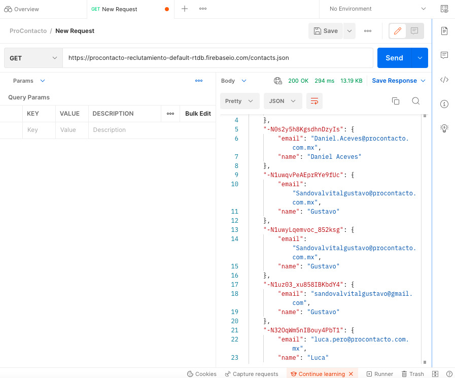


2. Realizar un request POST a la URL anterior, y con body:

```
{
"name":"Tu nombre",
"email":tunombre.tuapellido@procontacto.com.mx
}
```
Tip: (Marcar la opción “raw” como body)

**Respuesta:**
Realicé un POST a la URL ingresando mi nombre, apellido, esto me regresó el Id de mi nombre y se realizó el envío de los datos que ingresé. 


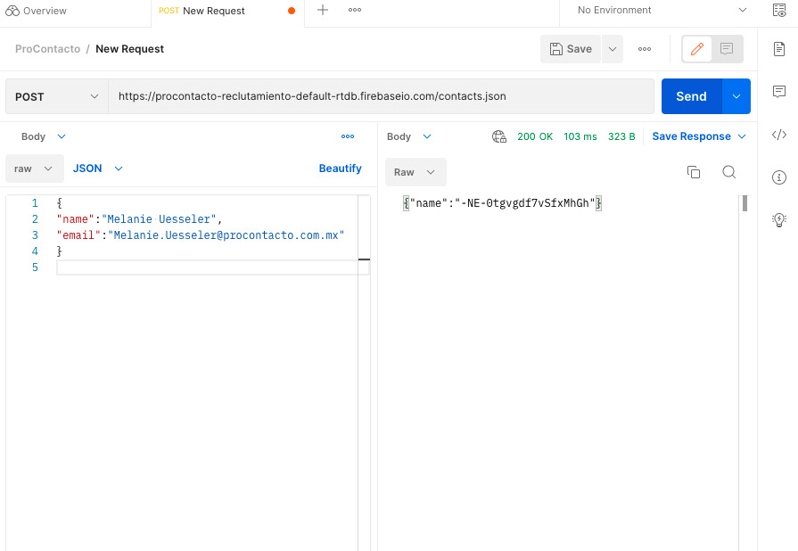
</details>


3. ¿Qué diferencias se observan entre las llamadas el punto 1 y 3?

**Respuesta:**
Realicé nuevamente un request GET a la URL solicitada y me regresó la información actualizada en formato JSON con los valores que ingresé en el punto anterior.


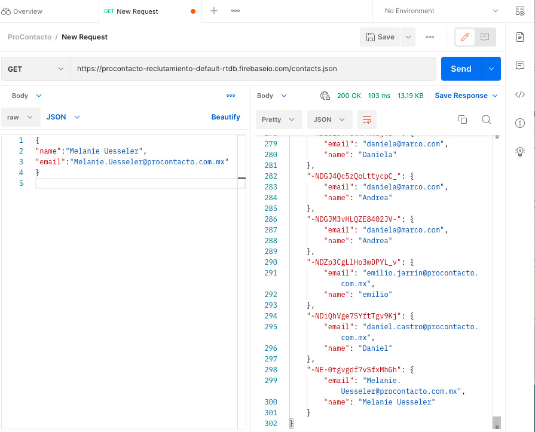


## Ejercicio 4 - Trailhead
[(Back to top)](#tabla-de-contenido)

Introducción a la configuración de SalesCloud, elementos básicos. 

:link: [Resolución de Módulos - Trailhead Salesforce](https://trailhead.salesforce.com/users/norozco3/trailmixes/introduccion)


## Ejercicio 5 - Objetos de Salesforce
[(Back to top)](#tabla-de-contenido)

Explicación conceptual de los objetos: 

<details><summary><b>Respuesta</b></summary>

    Lead 
        Es la solicitud o demanda de un cliente potencial o de un cliente real. Pueden llegar a su empresa a 
        través del sitio web, correo electrónico, llamada telefónica, etc. El vendedor evalúa este cliente 
        potencial y si encaja bien con los productos o servicios que su empresa proporciona, los convierte en 
        Salesforce. 

    Account
        Este objeto ayuda a almacenar información sobre los clientes con los que se hace negocios. Hay dos tipos, 
        cuentas comerciales y cuentas personales. Las cuentas comerciales almacenan información sobre las empresas, 
        mientras que las cuentas personales almacenan datos sobre las personas. 

    Contact
        Información relevante de los clientes, incluido su nombre de contacto, números de teléfono, correos 
        electrónicos y sus direcciones que está en su base de datos y ha sido calificada. Están asociados con una 
        cuenta, pero también pueden asociarse con otros registros, como oportunidades.

    Opportunity
        Es el proceso de rastrear todas las oportunidades de ventas potenciales en todo el proceso y convertirlas en 
        un ingreso. Ayuda en la creación y modificación de cotizaciones en respuesta a escenarios de venta y trato. 
        También se utiliza para gestionar la información sobre una venta o un acuerdo pendiente 

    Product
        El objetivo del producto es un catálogo de artículos o servicios para ventas. Puede contener uno o más conjuntos 
        de precios diferentes (PriceBookEntry) - no representa necesariamente solo un producto físico, también puede ser 
        un servicio, es decir, cualquier cosa que se este vendiendo

    PriceBook
        Almacena una lista de productos y servicios a la venta. Es una guía de precios que se puede utilizar en una o 
        más oportunidades diferentes donde tiene una o más entradas de precios diferentes

    Quote
        Es el presupuesto, para poder ganar la oportunidad – Donde se preparan los presupuestos que se necesita para 
        trabajar con 3 objetos diferentes: producto, libro de precios y la cotización

    Asset
        Los activos que representan los productos específicos que los clientes han comprado.  Representa un artículo 
        de valor comercial, como un producto vendido por la empresa o un competidor, que un cliente ha comprado. El 
        seguimiento de activos también es útil para el soporte de productos, ya que proporciona información detallada 
        para ayudar con sus problemas

    Case
        Su objetivo principal es almacenar información sobre cada problema, incluyendo la pregunta específica o los 
        comentarios de los clientes, el tiempo de resolución, los detalles del agente de apoyo, las diferentes acciones 
        que se requerían para resolver la solicitud y más. Registra cada interacción con el cliente y optimiza todo en 
        el panel de control

    Article
        Salesforce Knowledge nos permite crear y gestionar la información de nuestra empresa y compartirla de forma segura 
        cuando y donde sea necesaria. Pueden incluir información sobre el proceso, como cómo restablecer su producto a sus 
        valores predeterminados, o preguntas frecuentes como la cantidad de almacenamiento que admite su producto

    
</details>


**Diagram Draw.io**


## Ejercicio 6 - Conocimientos Básicos 
[(Back to top)](#tabla-de-contenido)


### Soluciones de Salesforce 

    A.¿Qué es Salesforce? 
        Es una plataforma de gestion de relacion con los clientes (CRM) con almacenamiento en la nube que proporciona 
        a todas las areas de la organización una visión unificada de los clientes en una plataforma integrada. Se 
        alimenta de metadatos y se compone de sevicios de datos, inteligencia artificial y API

    B.¿Qué es Sales Cloud?
        Es parte del sistema CRM que ofrece SalesForce, especialmente para vendedores . Ofrece automatización y 
        productividad para la fuerza de ventas optimizando procesos comerciales

    C.¿Qué es Service Cloud? 
        Es la aplicación para atención al cliente , se centra en manejar toda la actividad relacionada con la atención 
        al cliente

    D.¿Qué es Health Cloud? 
        Plataforma diseñada para la gestion clínica de pacientes por medio de tecnologia on-cloud . Gestiona interracción
        médico-paciente y el mantenimiento de registros,  ofreciendo comunicación más personalizada entre pacientes, 
        miembros , médicos

    E.¿Qué es Marketing Cloud? 
        Centraliza las comunicaciones con los clientes sobre múltiples canales

--
### Funcionalidades de Salesforce

    A.¿Qué es un RecordType?
        Nos permite definir diferentes Business Process, Pages Layaouts y Picklist Values en un determinado objeto. 
        Nos ayuda a mostrar diferentes tipos de informacion según el perfil del usuario

    B.¿Qué es un ReportType?
        Define el conjunto de registros y campos disponibles para un informe en función de las relaciones entre un 
        objeto primario y sus objetos relacionados

    C.¿Qué es un Page Layout?
        Controlan el diseño y la organización de los botones,campos, controles, enlaces, listas en la página de 
        registro de objetos. Tambien ayudan a determinar que campos son visibles de solo lectura y obligatorios

    D.¿Qué es un Compact Layout?
        Personaliza los campos que se muestran para los registro de objetos cuando se ven desde la aplicación 
        movil y Lightning Experience

    E.¿Qué es un Perfil?
        Define como acceden los usuarios a objetos y datos y que pueden hacer en la aplicación

    F.¿Qué es un Rol?
        Controla el nivel de visibilidad que un usuario tiene sobre los datos de su organización. Dependiendo la 
        funcion dada, pueden ver, editar, e informar sobre todos los datos

    G.¿Qué es un Validation Rule?
        Verifican que los datos que un usuario introduce en un registro, cumplan con los estándares que específica 
        antes de que el usuario pueda guardar el registro

    H.¿Qué diferencia hay entre una relación Master Detail y Lookup?
        - Master Detail- tiene muchas relaciones /Lookup – Busqueda externa. 
        - Master tienen objetos personalizados y un objeto estándar / Lookup esta entre dos objetos cualesquiera, 
        estándar o personalizados
        - Master si se elimina un registro en un objeto (padre) se eliminarán todos los registros en el objeto 
        (hijo) /Lookup Si se elimina un objeto (padre) puede configurar un objeto secundario
        - La seguridad y los registros de heredan en la Master Detail, en Lookup no hay proceso de herencia.

    I.¿Qué es un Sandbox?
        Crea copias de los clientes en entornos separados, ya sea para desarrollo, pruebas y la formación, sin 
        comprometer los datos y las aplicaciones del cliente en producción

    J.¿Qué es un ChangeSet?
        Conjunto de cambios que se ha enviado desde otra organización de Salesforce a la organización en la que 
        se ha iniciado sesión

    K.¿Para qué sirve el import Wizard de Salesforce? 
        Facilita la importacion de datos para muchos objetos estandar de Salesforce, incluidas cuentas, contactos, 
        clientes potenciales, soluciones

    L.¿Para qué sirve la funcionalidad Web to Lead? 
        Permite capturar automáticamente la información de los visitantes y la almacenan directamente en Salesforce

    M.¿Para qué sirve la funcionalidad Web to Case? 
        Ayuda a recopiar las solicitudes de atención al cliente directamente desde el sitio web del cliente y 
        generar automaticamente hasta 5000 casos al dia. Ayuda a responder a los clientes mas rápido, mejorando 
        productividad

    N.¿Para qué sirve la funcionalidad Omnichannel? 
        Ayuda al enrutamiento automático de diferentes tipos de elemento de trabajo (casos y clientes potenciales) 
        a los agentes

    O.¿Para qué sirve la funcionalidad Chatter? 
        Herramienta de comunicación , diseñada para la interacción y retroalimentación, intercambio de archivos y 
        encuestas entre los miembros del departamento comercial

--

### Conceptos generales

    A.¿Qué significa SaaS? 
        Software como servicio, permite a los usuarios conectarse a aplicaciones basadas en la nube a través de 
        internet como un servicio. No se necesita instalar, mantener o actualizar Hardwares

    B.¿Salesforce es Saas? 
        Si. Aloja una aplicación a la que los clientes pueden acceder en línea

    C.¿Qué significa que una solución sea Cloud? 
        Permite acceso remoto a sotfwares, almacenamiento de archivos y procesamiento de datos por medio de internet

    D.¿Qué significa que una solución sea On-Premise?
        Instalación del programa que se ha realizado de manera local, en las instalaciones de la empresa , obligando 
        a crear infraestructura informática

    E.¿Qué es un pipeline de ventas?
        Proceso de actividades y estrategias que necesita un vendedor para acelerar el ciclo de ventas, transformando 
        clientes potenciales en clientes de la empresa

    F.¿Qué es un funnel de ventas?
        Herramienta para planear y establece procesos para ponerse en contacto con los diferentes clientes. Representa 
        todo el proceso de cierre de un negocio, desde el momento de la captación hasta la conversión final

    G.¿Qué significa Customer Experience?
        Es la percepcion que el cliente genera por todaslas interacciones que mantiene con la marca

    H.¿Qué significa omnicanalidad? 
        Estrategia de comunicación para estar en contacto con los clientes a través de diferentes canales (Email, 
        redes sociales, sitio web)

    I.¿Qué significa que un negocio sea B2B?¿Qué significa que un negocio sea B2C?¿Qué es un KPI?
        - B2B (Business to Business ) Es el modelo de negocio en el que se realiza interacciones entre empresas – 
        Comercialización de productos y servicios con una empresa como cliente. 
        - B2C (Business to Customer ) Es el modelo de negocio en el que se realiza interacciones entre negocios y 
        los consumidores – Comercialización de productos y servicios con una persona particular como cliente. 
        - KPI (Key Performance Indicators ) Indicadores clave de desempeño, se utilizan para sintetizar la información 
        sobre la eficacia y productividad de las acciones que se lleven a cabo en un negocio

    J.¿Qué es una API y en qué se diferencia de una Rest API?
        - API es una interfaz de programacion de aplicaciones , permitiendo la comunicación entre dos aplicaciones 
        de sotfware. 
        - Rest API es una interfaz de programacion de aplicaciones (API o API Web) que se ajusta a los limites de la 
        arquitectura REST y permite la interaccion con los servicios web de RESTFull.
        - Diferencia: API sigue el formato de aplicación a aplicación , mientras que el REST sigue una estructura 
        diferente: Cliente-Servidor

    K.¿Qué es un Proceso Batch? 
        Procesamiento por lotes, donde se realiza procesos , de forma simultanea, continuada y secuencial

    L.¿Qué es Kanban? 
        Metodo visual de gestión de proyectos que permite a los equipo visualizar sus flujos de trabajo y la carta de 
        trabajo

    M.¿Qué es un ERP? 
        Enterprise Resource Planning (Sistema de planificación de recursos empresariales) – Programa que se hace cargo 
        de distintas operaciones internas de una empresa, desde producción a distribución o incluso recursos humanos

    N.¿Salesforce es un ERP? 
        No, Salesforce proporciona funciones críticas para las ventas y el servicio, pero no proporciona funcionalidad 
        ERP como inventario, producción, cadena de suministro y gestión financiera. Hoy en dia se puede ejecutar ERP 
        junto con CRM en la plataforma Salesforce Cloud ya que Rootstock Cloud ERP y Salesforce CRM comparten el mismo 
        modelo de datos


## Ejercicio 7 - Dataloader
[(Back to top)](#tabla-de-contenido)

Instalar la herramienta dataloader para mac e importar el archivo CSV.

1 - *Herramienta instalada*

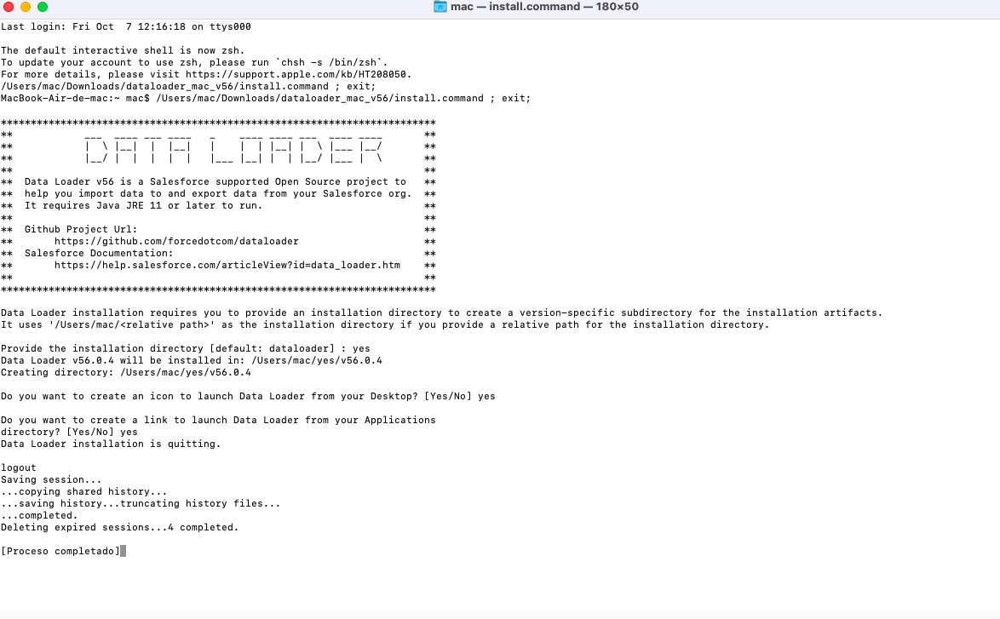 

2 - *Ejecución de Herramienta*

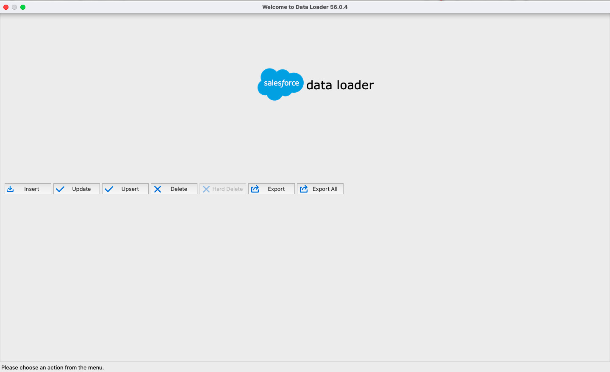 

3 - *Ingreso a los datos*

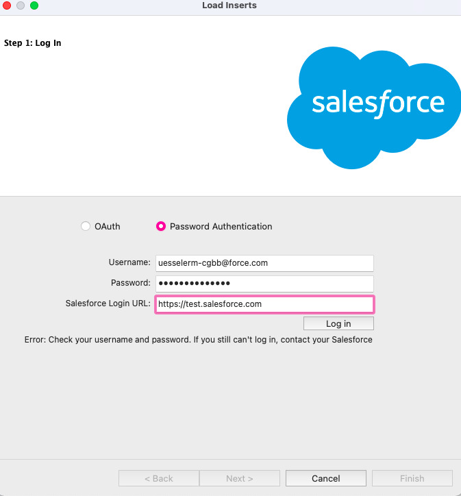  

4 - *Ingreso a la página de Salesforce desde DataLoader*

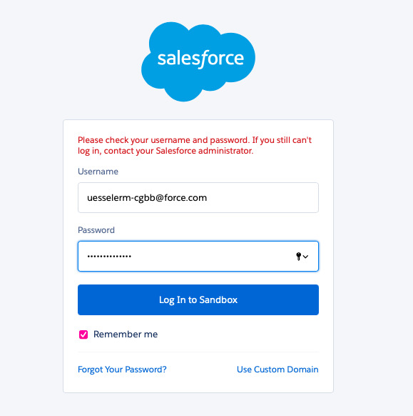   

5 - *Cambio de contraseña desde pagina Salesforce para confirmar ingreso desde DataLoader* 

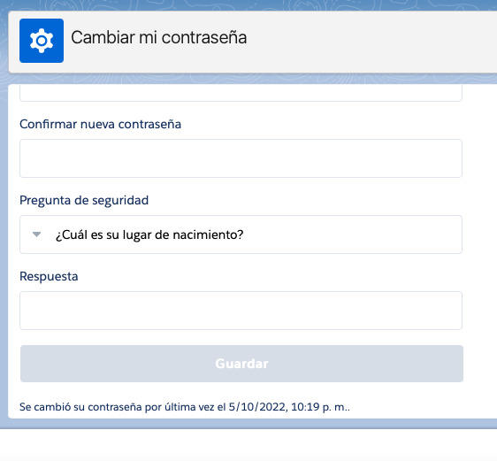  


    NOTE
       
       * No se permitio ingreso al Dataloader con cambio de contraseña y Cambio de URL
       * URLs https://transunion2.my.salesforce.com / https://test.salesforce.com
       


